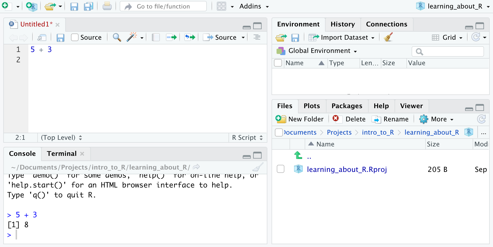

```{r setup, include=FALSE}
knitr::opts_chunk$set(echo = TRUE)
```

```{css, echo=FALSE}
body, h1, header1, header2, header3, p, li {
  font-family: 'SF Mono Regular';
  -webkit-user-select: none;  /* Chrome all / Safari all */
  -moz-user-select: none;     /* Firefox all */
  -ms-user-select: none;      /* IE 10+ */
  user-select: none;          /* Likely future */ 
}

.col2 {
    columns: 2 200px;         /* number of columns and width in pixels*/
    -webkit-columns: 2 200px; /* chrome, safari */
    -moz-columns: 2 200px;    /* firefox */
}

.col3 {
    columns: 3 100px;
    -webkit-columns: 3 100px;
    -moz-columns: 3 100px;
}
  
```

[cobriant.github.io](https://cobriant.github.io/)

```{r, include = F}
library(tidyverse)
library(gapminder)
```


## Introduction to the course

This is a crash course in R using the tidyverse ecosystem. It's written for anyone with very limited programming experience who is interested in doing statistical computing, data science, or simulations in R.

I initially used it to teach first-year econ, finance, and accounting PhD students, but I've rewritten it to be a little more suitable for undergrads or maybe even high school students with some stats knowledge. Some numerical/statistical literacy may be required: I use and don't explain terms like vectors, histograms, and the normal distribution.

<br>

I'm making this resource public because, while there are a ton of free offerings available to learn R, I don't think there exists a resource that's as beginner-friendly while also being fairly comprehensive. In my opinion, other resources make **2 fatal mistakes** when teaching R:

1. **At the beginning they try to teach you computer science** instead of the stuff you're actually interested in (working with data!). You don't have to be a computer scientist to use R well. Eventually you may want to learn more about that kind of stuff, but if it's taught as a necessary prerequisite, it's going to (understandably) turn off a lot of people.

2. **They teach you "imperative programming"** full of `for` loops, `if` statements, and even `while` loops. The alternative is to learn "declarative programming," where you'll use powerful `tidyverse` tools from packages including `dplyr` and `purrr` to tell R *what you want it to do* rather than *how exactly to do it*. A good metaphor is that imperative programming is like giving your friend a packet of step-by-step driving instructions to get from their house to yours. Declarative programming is like just texting them your address. We all have GPS to tell us how to get places, so it's a little silly to pretend we don't have those better tools.

<br>

Besides, when you're learning to program, writing declaratively will let you focus on the big picture instead of getting hung up on the details. You'll find solving complicated problems in R is easy and fun. Your code will also be clear and succinct, which has many advantages. For example, when you make mistakes, you'll be able to find them easier. And when you want to share your code with other tidyverse users, they'll be able to quickly read and understand it.

Hopefully you'll enjoy this crash course and you'll find that making use of the tidyverse ecosystem is powerful and easy once you learn the syntax. I tried to make each post about an hour's worth of material, but some might run a little long. Take your time and explore. I taught this crash course to the PhD students over the course of 10 weeks, so don't feel like you need to rush through it. Every post, I embed a handful of exercises that you can do in RStudio to check your understanding, and then a slightly longer "assignment" at the end. I've also written answers to everything so you can check your work.

Don't hesitate to contact me at cobriant\@uoregon.edu if you have any feedback or questions or suggestions.

<br>

Here's a quick preview of what's to come, and then we'll start with `Week 1: downloading R and RStudio on your computer` (it's all free)!

## Table of contents

<div class="col2">

#### Week 1

Install R and get to know RStudio

#### Week 2

Data structures

#### Week 3

Data Visualization with `ggplot2`

#### Week 4

Data manipulation with `dplyr`

<br>

#### Week 5

Conditionals and functions

#### Week 6

Iteration with `purrr`

#### Week 7

Putting it all together: Final Project


</div>

## 1 Installing R and RStudio

First things first, you'll need to download and install R and RStudio on your computer. R is the language and RStudio is the development environment you'll use to run your code, inspect your data, and take a look at your visualiations.

[Here](https://courses.edx.org/courses/UTAustinX/UT.7.01x/3T2014/56c5437b88fa43cf828bff5371c6a924/) are some straightforward instructions to download R and RStudio on a Mac or Windows machine. Disregard instructions to install the SDSFoundations package.

## 2 Creating a project

You're ready to create your first project! Here's how:

* Open RStudio.
* File > New Project > New Directory > New Project.
* Name your directory something descriptive like "learning_R"
* Make it a subdirectory of "Documents" or wherever you prefer.
* Finally, create the project!

## 3 Check everything works

Now's a good time to double check that you've followed all the steps correctly. 

* Open a new R Script by going to File > New File > R Script. An R script holds code.
* Type 5 + 3 in your new R script and hit "Run" (or on a mac, press Command + Enter) in the upper right of the pane. Throughout this guide, I'll include keyboard shortcuts for macs only. If you're on a windows machine or you want to find out more keyboard shortcuts, in RStudio, go to Tools > Keyboard Shortcuts Help.
* If you've done everything right, this should show up in your console:

```{r, eval = F}
# > 5 + 3
# [1] 8
```

The [1] just means that the first (and only actually) element of the output is 8.

Great job, now you're a programmer! Next we'll learn a little about the RStudio environment you see in front of you (the IDE: Integrated Development Environment).

## 4 RStudio IDE

Here's about what your IDE should look like:



**The upper left pane is your R script.** You can write code up here and save it as a document: a *script*. You can run parts of your script by pressing the green arrow that says Run the current line or selection. You can also have multiple tabs at once in this pane: try starting a second R script.

**The lower left pane is your console.** You can type code directly in here to see if it runs. I think of this as my testing ground: I write pieces of code in here, and when I'm sure that it works the way I want it to, I'll copy-paste it up into my R Script.

**The lower right pane is for Files, Plots, Packages, and Help.** 

* The `Files` tab shows you everything you've saved in the Project you made. If you save your R script, it will show up there. 
* The `Plots` tab will automatically open to show you any plots you make. We'll see this a lot in week 3 when we do data visualization with ggplot2!
* The `Packages` tab show you any packages you've downloaded from the web to use with R. The main package we'll be using is a package called `tidyverse`, which is a collection of other packages (including `ggplot2`, `dplyr`, and `purrr`) that work nicely together and help you manipulate data and visualize it in R.
* The `Help` tab brings up help documentation on any function in any package you've downloaded. It's a good idea to make use of this function as much as possible! Before you google your questions, take a little time to read some relevant help docs. It'll slowly get you more comfortable over time with how the language works.
* The `Viewer` tab isn't something we'll use in this course, but you can use it to do things like preview a powerpoint presentation as you're writing it in RStudio.

**The upper right pane is for your Environment, History and Connections.** 

* The `Environment` tells you what variables you've created in your *global environment*. Right now, that environment is empty, so it's blank. Type in your console `x <- 3`. We'll read this as, "x gets 3". You've created a variable with the name `x` and assigned the value 3 to it. You've also saved that variable to your global environment, so that if you continue to refer to x, R knows what you're talking about and will evaluate it like it's equivalent to 3. You should see your Environment is updated with a variable named x, with a type numeric, length 1 (it's actually a vector of length 1), a certain size in memory, and a value of 3.
* The `History` tab shows you commands you've run. It comes with a helpful search bar. It also comes with a little broom icon, which you'll see all over the IDE. Hitting this will clean up the work space. I don't use this very often at all, but if you feel like things are becoming cluttered and it's starting to confuse you, it's nice to start fresh sometimes.
* The `Connections` pane is for connecting to things like databases. We won't get into that in this crash course cause all the data we'll need can easily be downloaded.

Lastly, the header can be a little intimidating at first glance as well, so I'll give you an overview of that.

**File**: 

* `New File`
  + R Scripts are for writing and saving your code
  + R Markdown is also fantastic if you want to mix text and code in a report (along with images, animations, and whatever else). I've used R Markdown to write this page and all of the lessons in this crash course.
  + Text file can be helpful too.
* `Open project`: changes which R project you're in
* `Open project in new session`: opens another RStudio window, so you can have 2 different projects open at once.
* `Save`: very important! RStudio doesn't crash on me often, but it's always a good idea to save your work frequently. I'll usually just use the keyboard shortcut Command S.

**Edit** 

* `Find`: (or use keyboard shortcut Command F): find a word in your R script, R markdown file, or text file. It's easy to find and replace one instance or all instances at once. You can also use regular expressions by clicking "Regex" if you know what that is.

**Tools**

* `Keyboard Shortcuts Help` for finding time-saving keyboard shortcuts

**Help**

* `Search` bar for searching help topics
* `Cheatsheets` points you to a couple great resources, also available online at [https://rstudio.com/resources/cheatsheets/](https://rstudio.com/resources/cheatsheets/). Check out the RStudio IDE Cheat Sheet right now!

<br>

## 5 Packages

R comes pre-loaded with a couple packages that have lots of useful functions.

### 5.1 `base`

One of these packages is called `base`. You'll use functions from `base` all the time to do basic things like arithmetic in R.

For instance, `base` includes a function called `log` that you can use to take the log of a number. When you use `log`, you can refer to it in 2 different ways:

```{r, eval = F}
# First way: just use the name of the function
log(5)
#> [1] 1.609438

# Second way: use the name of the package it comes from as well. If you've downloaded a second package also
#  with a function called `log`, this way makes sure you're using the function from the base package.
base::log(5)
#> [1] 1.609438
```

<br>

#### Exercise 1: {.tabset .tabset-fade .tabset-pills}

Use `base::Arithmetic` to multiply 12309 and 983 in R.

##### Hint

* Run `?Arithmetic` or `?base::Arithmetic` in your console to read the help documentation. Make sure to check out the Description, Usage, Arguments, and the Examples section at the way bottom.

##### Answer

```{r, eval = F}
# The function that multiplies two numbers from `Arithmetic` is `*`.
#   Add spaces or don't: R will always ignore your white space.

12309*983
#> [1] 12099747

12309 * 983
#> [1] 12099747
```

####

<br><br><br>

### 5.2 `stats`

`stats` is another package that comes pre-loaded into R. It comes with all kinds of distributions and functions that are useful for statistics.

A function that I use all the time is `stats::rnorm`. It generates random numbers from a normal distribution.

```{r, eval = F}
# Generate 5 random numbers from a normal distribution with a mean of 50 and standard deviation of 10:
rnorm(n = 5, mean = 50, sd = 10)

#> [1] 50.55790 40.38335 48.89286 51.12419 49.65318
```

The package `stats` even has functions that solve the famous birthday paradox for you!

<br><br>

#### Exercise 2: {.tabset .tabset-fade .tabset-pills}

Use `stats::pbirthday` to find the probability that with a group of 30 people, 2 people have the same birthday. How about 3 people?

##### Hint

Run `?pbirthday` in your console to access the help documentation and find out how to use the `pbirthday` function. Make sure to check out the Description, Usage, Arguments, and Examples sections.

##### Answer

```{r, eval = F}
pbirthday(n = 30)

#> [1] 0.7063162
```

Yep, the probability that 2 people in a room of 30 will have the same birthday is greater than 70%!

```{r, eval = F}
pbirthday(n = 30, coincident = 3)

#> [1] 0.03126574
```

The probability that 3 people in a room of 30 have the same birthday goes down to 3%.

####

<br><br><br>

### 5.3 Packages from the web

Now let's add some more packages! 

Getting started with a new package in R is simple and straightforward. You'll always do the same 2-step process:

1. install it with `install.packages("package_name_here")`
2. load it into the current R session with `library(package_name_here)`

Then you're ready to go!

Let's practice with a package you'll be using a lot. It's called `tidyverse`, and it's actually a bundle of useful packages we'll learn about later, including `dplyr`, `ggplot2`, and `purrr`.

Run the `install.packages()` function like this, with `tidyverse` in quotes. Usually you don't need dependencies to be TRUE, but if you get errors, this is a good move to try and troubleshoot.

```{r, eval = F}
install.packages("tidyverse", dependencies = TRUE)
```

Now load it using `library()`, and `tidyverse` not in quotes this time:

```{r, eval = F}
library(tidyverse)
```

Now you're ready to start using functions from `tidyverse`! When you close and reopen RStudio in a new session, you won't have to install the tidyverse again (it's already installed on your computer), but you will have to load it into the session again. So next time, all you need to do is say `library(tidyverse)` to use tidyverse functions next time.

<br><br>

#### Exercise 3: {.tabset .tabset-fade .tabset-pills}

Install and load a package called `gapminder`. I'll be using the sample dataset in `gapminder` a lot while we learn R basics. It has historical census-type information from around the world.

##### Hint

2 Step procedure:

1. install it with `install.packages("package_name_here")`
2. load it into the current R session with `library(package_name_here)`

##### Answer

```{r, eval = F}
install.packages("gapminder")
library(gapminder)
```

####

<br><br>

### 5.4 Test that your packages are working properly

Test that you've properly installed and attached `tidyverse` and `gapminder` by running this code:

```{r, eval = F}
# Use `head()` to get the first 6 rows of the dataset
head(gapminder)

#> A tibble: 6 x 6
#>  country     continent  year lifeExp      pop gdpPercap
#>  <fct>       <fct>     <int>   <dbl>    <int>     <dbl>
#> 1 Afghanistan Asia       1952    28.8  8425333      779.
#> 2 Afghanistan Asia       1957    30.3  9240934      821.
#> 3 Afghanistan Asia       1962    32.0 10267083      853.
#> 4 Afghanistan Asia       1967    34.0 11537966      836.
#> 5 Afghanistan Asia       1972    36.1 13079460      740.
#> 6 Afghanistan Asia       1977    38.4 14880372      786.

# Use `tail()` to see the last 6
tail(gapminder)

# A tibble: 6 x 6
#>  country  continent  year lifeExp      pop gdpPercap
#>  <fct>    <fct>     <int>   <dbl>    <int>     <dbl>
#> 1 Zimbabwe Africa     1982    60.4  7636524      789.
#> 2 Zimbabwe Africa     1987    62.4  9216418      706.
#> 3 Zimbabwe Africa     1992    60.4 10704340      693.
#> 4 Zimbabwe Africa     1997    46.8 11404948      792.
#> 5 Zimbabwe Africa     2002    40.0 11926563      672.
#> 6 Zimbabwe Africa     2007    43.5 12311143      470.

# Use `tidyverse::filter()` to filter only the observations with the highest life expectances 
#   (lifeExp greater than 81)
filter(gapminder, lifeExp > 81)

# A tibble: 7 x 6
#>  country          continent  year lifeExp       pop gdpPercap
#>  <fct>            <fct>     <int>   <dbl>     <int>     <dbl>
#>  1 Australia        Oceania    2007    81.2  20434176    34435.
#>  2 Hong Kong, China Asia       2002    81.5   6762476    30209.
#>  3 Hong Kong, China Asia       2007    82.2   6980412    39725.
#>  4 Iceland          Europe     2007    81.8    301931    36181.
#>  5 Japan            Asia       2002    82   127065841    28605.
#>  6 Japan            Asia       2007    82.6 127467972    31656.
#>  7 Switzerland      Europe     2007    81.7   7554661    37506.
```

You can also take a look at the entire dataset by opening a new tab to view it with a function `View()`:
```{r, eval = F}
View(gapminder)
```

## 6 R markdown

One final package to install and attach is `rmarkdown`. Like I said before, R Markdown is a great tool for creating beautiful reports that mix text, code, images, and whatever else you want. I wrote all the lessons in this crash course in R Markdown. I'll quickly review the ins and outs of using it.

1. Run this code to start using R Markdown:

```{r, eval = F}
install.packages("rmarkdown", dependencies = TRUE)
library(rmarkdown)
```

2. File > New File > R Markdown

* Title your new R Markdown document whatever you like
* Accept the Default Option Format: HTML
* Leave alone everything in lines 1-8 for now

3. Learning the formatting can be a little tricky at first.

* To create a header, use `# Title Here` for the biggest titles, `## Title Here` for the second biggest, `### Title Here` for the third, and on.
* To add a code chunk, use the keyboard shortcut Command Option I.
* To create a bulleted list like this, use asterisks or dashes.

When you're ready to see what you've produced, "knit" the document to HTML (keyboard shortcut: Shift Command K).

## 7 Assignment 1

Create a R Markdown document with your notes from this week's lesson. Make sure to include some text and some code chunks. And make sure it "knits"!

If you use a package from the web like `gapminder` or `tidyverse`, begin your document by attaching it in a code chunk. You don't need to install it again.

```{r, eval = F}
library(gapminder)
```

